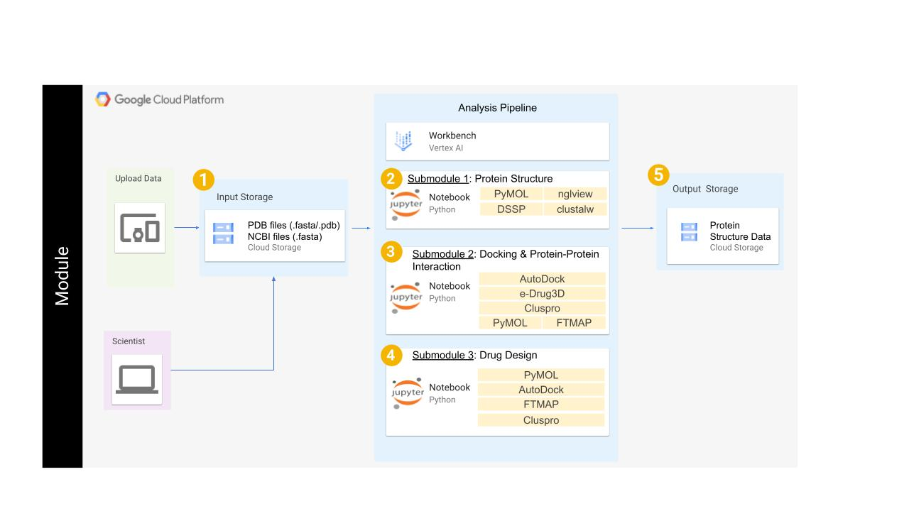

# Structural Biology and Drug Discovery

-------------

## **Contents**

- [Background](#background)
- [Overview](#overview)
- [Before Starting](#before-starting)
- [Getting Started](#getting-started)
- [Software Requirements](#software-requirements)
- [Architecture Design](#architecture-design)
- [Data](#data)
- [Funding](#funding)
- [License for Data](#license-for-data)

## **Background**
This module covers basics of structural biology of proteins, visualization of details of protein structure and use computational and structural biology methods to design drugs that target protein receptors. Different methods of drug design, such as enzyme-based drug design, receptor-based drug design and protein-protein interaction drug design are covered. The module is developed in such a way that the user can go through the basic aspects of each section with activities that help to learn the concepts. Quiz and assignments are provided to reinforce the concepts learned. The module is divided into three submodules and these submodules are further divided into sections so that users can follow each section separately. Basic chemistry and Biochemistry knowledge is expected to work on these modules. Before working on submodules, users can go through training of PyMol molecular visualization software.

## **Overview**
- The <u>Structural Biology and Drug Discovery</u> module consists of three submodules and each of the three submodules are broken into three parts. 
- In total the module consists of **nine** notebooks that you must complete. Details on each of the submodules are provided below:

## **Module Design**

### Submodule 1 - Protein Structure
This submodule serves as an introductory module for drug design, and any undergraduate student can use this module to learn the protein structure. The module starts with the learning of basic protein structure in detail from primary, secondary, tertiary, and quaternary structures with examples. Each part involves examples and tutorials using visualization software. Quizzes and assignments are provided to test the user’s knowledge.  This module can run on Google Cloud Platform (GCP) and python commands are used. Visualization is done in GUI mode or protein structure visualization tools can also be used in command mode using PyMol. 

### Submodule 2 - Docking and Protein-Protein Interaction
This module takes the user step-by-step through preparing the protein and ligand for docking calculations and analysis. Users can extract the ligands from the protein data bank. Ligands can also be prepared by sketching, generating a 3D structure of the ligand in PDB format.  Examples of PDB drug-protein complexes will be used to demonstrate docking using docking software. Analysis and preparation of files for presentation and detailed description are provided.

### Submodule 3 - Drug Design
In this module, users learn different types of drug design with examples, visualization, and tutorials. Enzyme-based drug design, receptor-based drug design, and peptide-based drug design (along with protein-protein interaction and drug design) are demonstrated. This module uses all the software and knowledge used in Modules 1 and 2 and combines this knowledge to study the design of drugs. This module requires Modules 1 and 2 as prerequisites if the users are unfamiliar with the analysis of protein structure, binding cavity, docking, and protein-protein interactions

<center></center><br><br>

## **Before Starting**
This module is designed to run on the Google Cloud Platform (GCP). Follow the instructions below to prepare to run the module on GCP.

#### Setting up GCP

This module is designed to run on the Google Cloud Platform (GCP).
Follow the instructions below to prepare to run the module on GCP.

<details>

<summary>Setting up GCP</summary>

See the [Vertex AI Quickstart instructions](https://cloud.google.com/vertex-ai/docs/workbench/instances/create-console-quickstart) for details on steps 1-5.

1. Create a Google Cloud account
2. Create a Google Cloud project
3. Enable billing for your Google Cloud project
4. Go to Vertex AI Workbench and create a new instance using "CREATE NEW" -> "ADVANCED OPTIONS" and use the following configurations:
   * Details:<br/>&emsp;Region: us-east4<br/>&emsp;Zone: us-east4-a<br/>&emsp;Workbench type:<br/>&emsp;&emsp;Type: Instance
   * Environment:<br/>&emsp;JupyterLab Version: JupyterLab 4.x
   * Machine type:<br/>&emsp;Series: e2<br/>&emsp;Machine type: e2-standard-8<br/>&emsp;Idle shutdown:<br/>&emsp;&emsp;Enable Idle Shutdown: Checked<br/>&emsp;&emsp;Time of inactivity before shutdown (Minutes): 60
   * Disks: Use default settings
   * Networking:<br/>&emsp;Assign external IP address: Checked<br/>&emsp;Allow proxy access: Checked
   * IAM and security<br/>&emsp;Security options:<br/>&emsp;&emsp;Root access to the instance: Checked<br/>&emsp;&emsp;File downloading: Checked<br/>&emsp;&emsp;Terminal access: Checked
   * System health: Use default settings
5. Click "OPEN JUPYTERLAB" on your instance to open JupyterLab
6. To clone the Github repository for this module in JupyterLab, open a Terminal (File -> New Launcher -> Terminal) and run the following commands:
```bash
cd ~
git clone https://github.com/rmagesh148/Structural-Biology-and-Drug-Discovery.git
```
<br>    
After the last command completes there should be a folder name *Structural-Biology-and-Drug-Discovery* that contains each submodule directory. Start with Submodule 0 to confirm you can spin up the PyMOL and AutoDock GUIs.    

</details>

## **Getting Started**
After you work through Submodule 0 please begin working through Submodules 1 - 3 in order. Each submodule notebook will consist of some background information and activities. For the activities, you will execute the code cells and/or work within the PyMOL/AutoDock VM's that you create based on the guidance provided in Submodule 0. Submodule 4 contains **OPTIONAL** activities relevant to the knowledge and skills provided through navigating Submodules 1-3 that can be completed for extra practice.

## **Software Requirements**
Access to PyMOL and Autodock software are provided through Submodule 0. All other required software is either downloaded through code execution within the notebook or, in limited situations, accessed through internal sites using the provided links.

## **Data**
- Coordinates of 3D structures of proteins and sequence of proteins are directly downloaded from the protein data bank (PDB) and Uniprot sequence database respectively. 
- Some of the coordinates of protein domains are provided as a separate file (in directory (mention here)) so that users can use these files to visualize part of the protein for detailed measurement purposes.

## **Funding**
This resource was supported with funds from NIH grant P20 GM103424-21 

## **License for Data**
Text and materials are licensed under a Creative Commons CC-BY-NC-SA license. The license allows you to copy, remix and redistribute any of our publicly available materials, under the condition that you attribute the work (details in the license) and do not make profits from it. More information is available here.


